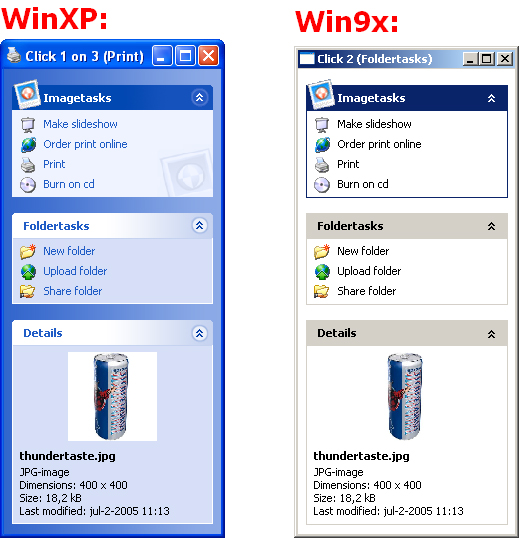



## XP Style ExplorerBar \(Updated 1\-aug\-2005\)

### Description

An ExplorerBar, just like WinXP has!

It's compitable with WinXP, but in Win9x also (but classic style will be used).

No custom images are used, all with Api.

It's flickerfree!

For transparant images it only supports .ICO files.

You can add a normal group, special group and a details group.

All can have a background and a bigicon.

The normal and special items can have sub items, the details group only text.

Have fun!#############################################

Updated! A bug fixed: when it was collapsed the Click mouseicon showed up.

#############################################

Another update: Now Paul Caton's Subclassing, so the timer is gone. And a scrollbar when the usercontrol is too small!
 
### More Info
 

             |
---                |---
**Submitted On**   |2005-08-01 18:00:04
**By**             |[Alex Flex](https://github.com/Planet-Source-Code/PSCIndex/blob/master/ByAuthor/alex-flex.md)
**Level**          |Advanced
**User Rating**    |5.0 (140 globes from 28 users)
**Compatibility**  |VB 6\.0
**Category**       |[Custom Controls/ Forms/  Menus](https://github.com/Planet-Source-Code/PSCIndex/blob/master/ByCategory/custom-controls-forms-menus__1-4.md)
**World**          |[Visual Basic](https://github.com/Planet-Source-Code/PSCIndex/blob/master/ByWorld/visual-basic.md)
**Archive File**   |[XP\_Style\_E191981812005\.zip](https://github.com/Planet-Source-Code/alex-flex-xp-style-explorerbar-updated-1-aug-2005__1-61899/archive/master.zip)

### API Declarations

Some

